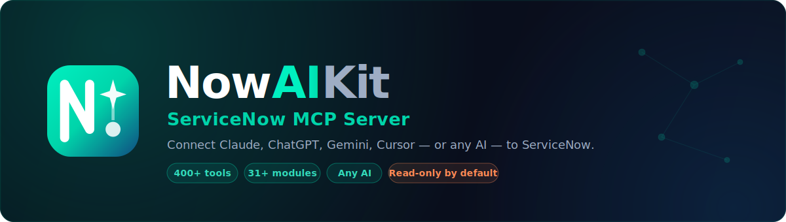

<div align="center">



<br/>

[](https://github.com/aartiq/nowaikit)
[](docs/TOOLS.md)
[](https://www.typescriptlang.org/)
[](LICENSE)
[](https://developer.servicenow.com)
[](https://modelcontextprotocol.io)
[](https://nodejs.org)

<br/>

# now-ai-kit

## The Most Comprehensive ServiceNow AI Kit

> AI-powered &bull; Multi-agent &bull; Multi-provider &bull; 270+ tools &bull; All ServiceNow modules &bull; 5-minute setup &bull; MIT licensed

**now-ai-kit** is the most comprehensive and easiest-to-set-up AI toolkit for ServiceNow.
Connect Claude, ChatGPT, Gemini, Google AI Studio, Cursor, GitHub Copilot, or any MCP-compatible AI to your ServiceNow instance in **under 5 minutes** — and let your AI read, build, deploy, and automate across all ServiceNow modules.

Ask questions, write scripts, deploy portal widgets, trigger flows, manage incidents, automate HRSD and CSM workflows, run ATF tests, build integrations, and fire events — all from your AI chat window, in plain English.

**Works with any AI. Works on any instance. Works for everyone. 100% open-source.**

<br/>

| | |
|---|---|
| **Beginners** | Connect in 5 minutes. Ask questions in plain English. No API knowledge needed. Free PDI at developer.servicenow.com. |
| **Developers** | Write, deploy, test, and manage scripts, flows, widgets, and integrations at AI speed. |
| **Architects** | Orchestrate multi-step autonomous workflows, multi-instance comparisons, and agentic AI automation. |

<br/>

</div>

---

## Who Is This For?

<table>
<tr>
<td width="33%" valign="top">

### Beginners
**Zero ServiceNow API knowledge required.**

Connect Claude Desktop or Cursor to your ServiceNow PDI in 5 minutes. Ask plain English questions, browse incidents, search knowledge articles, place catalog orders, and monitor SLAs — all from your AI chat window. No code, no Postman, no documentation diving.

*Start here → [5-Minute Quickstart](#getting-started)*

</td>
<td width="33%" valign="top">

### Developers
**Build faster with AI as your development partner.**

Let your AI write business rules, create client scripts, manage UI Policies and ACLs, deploy Service Portal widgets, configure REST Messages, and manage Transform Maps — all with full TypeScript types, changeset support, and ATF test integration. Role-based packages scope tools to exactly what you need.

*Explore → [Platform Developer Package](#role-based-tool-packages)*

</td>
<td width="33%" valign="top">

### Architects & Advanced Users
**Autonomous multi-agent workflows across your full platform.**

Trigger Agentic Playbooks, run predictive intelligence models, fire and monitor events, compare record counts across environments, audit data quality, and orchestrate multi-step ITSM/HRSD/CSM processes — all from a single AI session with multi-instance support.

*Deep dive → [Now Assist & Agentic Guide](docs/NOW_ASSIST.md)*

</td>
</tr>
</table>

---

## Why now-ai-kit

<table>
<tr>
<td width="33%" valign="top">

### Autonomous AI Operations

Go beyond Q&A. Your AI agent can autonomously create incidents, write and deploy scripts, trigger flows, fire events, upload attachments, manage changesets, and run ATF test suites — completing multi-step tasks end-to-end without manual intervention. Supports Now Assist Agentic Playbooks for native ServiceNow AI automation.

</td>
<td width="33%" valign="top">

### Multi-Provider, Any Agent

Works with every major AI platform out of the box — **Claude**, **ChatGPT**, **Gemini**, **Grok**, **Cursor**, **Windsurf**, **GitHub Copilot**, **Continue.dev**, **Cline**, **Amazon Q**, **JetBrains AI**, **Zed**, **Ollama**. Any MCP-compatible agent or custom Python/TypeScript agent via the Anthropic Agent SDK. OAuth 2.0 and Basic Auth for every integration.

</td>
<td width="33%" valign="top">

### Broadest Platform Coverage

270+ production-ready tools spanning every ServiceNow domain: ITSM, ITOM, HRSD, CSM, SecOps, GRC, Agile, ATF, Flow Designer, Scripting, Now Assist, Service Portal, Integration Hub, Notifications, Performance Analytics, and more — the most complete AI toolkit for ServiceNow available.

</td>
</tr>
<tr>
<td width="33%" valign="top">

### Role-Based Intelligence

Twelve pre-built persona packages — service desk, platform developer, portal developer, integration engineer, ITOM engineer, AI developer, and more. Each package exposes exactly the right 15–55 tools for that role, reducing noise and enforcing least-privilege access. Configure once per team.

</td>
<td width="33%" valign="top">

### Safe by Default

A five-tier permission model ensures every operation is explicitly authorised. Read is always on; write, CMDB, scripting, and Now Assist each require a dedicated opt-in flag. Your instance cannot be accidentally modified by an AI without deliberate configuration.

</td>
<td width="33%" valign="top">

### Production-Ready Documentation

Full TypeScript types, 120+ real-world examples, 9 reference guides, and beginner + advanced setup instructions for every major AI client. Built on the latest ServiceNow APIs. Multi-instance support for prod/staging/dev from a single session.

</td>
</tr>
</table>

---

## Quick Links

| Resource | Link |
|----------|------|
| All Tools Reference | [docs/TOOLS.md](docs/TOOLS.md) |
| Client Setup (All AI tools, beginner + advanced) | [docs/CLIENT_SETUP.md](docs/CLIENT_SETUP.md) |
| Role-Based Tool Packages | [docs/TOOL_PACKAGES.md](docs/TOOL_PACKAGES.md) |
| Now Assist & AI Integration | [docs/NOW_ASSIST.md](docs/NOW_ASSIST.md) |
| ATF Testing Guide | [docs/ATF.md](docs/ATF.md) |
| Scripting Management | [docs/SCRIPTING.md](docs/SCRIPTING.md) |
| Reporting & Analytics | [docs/REPORTING.md](docs/REPORTING.md) |
| Multi-Instance Setup | [docs/MULTI_INSTANCE.md](docs/MULTI_INSTANCE.md) |
| 120+ Real-World Examples | [EXAMPLES.md](EXAMPLES.md) |
| Changelog | [CHANGELOG.md](CHANGELOG.md) |

---

## Module Coverage

Domain modules covering the full ServiceNow platform:

| Module | Key Capabilities | Tools |
|--------|-----------------|------:|
| Core & CMDB | Record query, schema discovery, CMDB CIs, ITOM Discovery, MID Servers, multi-instance management | 19 |
| Incident Management | Create, update, resolve, close, work notes, comments | 7 |
| Problem Management | Problem records, root cause analysis, known errors | 4 |
| Change Management | Create, get, update, submit for approval, close change requests | 6 |
| Task Management | Generic tasks, my-task lists, completions | 4 |
| Knowledge Base | Search, create, update, publish KB articles | 6 |
| Service Catalog & Approvals | Catalog browsing, order items, SLA tracking, approval workflows | 10 |
| User & Group Management | Users, groups, membership, role assignments | 8 |
| Reporting & Analytics | Aggregate queries, trend analysis, **scheduled job CRUD**, run history | 13 |
| ATF Testing | Test suites, test execution, ATF Failure Insight | 9 |
| Now Assist / AI | NLQ, AI Search, summaries, resolution suggestions, Agentic Playbooks | 10 |
| Scripting | Business rules, script includes, **client script CRUD**, **UI Policies**, **UI Actions**, **ACL management**, changesets | 27 |
| Agile / Scrum | Stories, epics, sprints, scrum tasks | 9 |
| HR Service Delivery (HRSD) | HR cases, HR services, employee profiles, onboarding/offboarding | 12 |
| Customer Service Management (CSM) | Customer cases, accounts, contacts, products, SLAs | 11 |
| Security Operations & GRC | SecOps incidents, vulnerabilities, GRC risks, controls, threat intel | 11 |
| Flow Designer & Process Automation | Flows, subflows, triggers, executions, Process Automation playbooks | 10 |
| Service Portal & UI Builder | Portals, pages, **widgets (create/update/deploy)**, Next Experience apps/pages, themes | 14 |
| Integration Hub | REST Messages, Transform Maps, Import Sets, **Event Registry**, OAuth apps, credential aliases | 19 |
| Notifications & Attachments | Email notifications, email logs, **file attachments (upload/list/delete)**, templates, subscriptions | 12 |
| Performance Analytics | PA indicators/scorecards, time-series, dashboards, PA jobs, **data quality checks** | 13 |
| System Properties | Get, set, bulk operations, validate, export/import, audit history | 12 |
| Update Set Management | Create, switch, preview, complete, export, auto-ensure active set | 8 |
| Virtual Agent (VA) | Topic authoring, conversation history, categories, topic listing | 7 |
| IT Asset Management (ITAM) | Assets, software licenses, contracts, compliance reporting | 8 |
| DevOps & Pipeline Tracking | Pipelines, deployments, change governance, DORA metrics | 7 |
| **Total** | | **276** |

---

## Authentication

Both **Basic Auth** and **OAuth 2.0** are fully supported across all client integrations:

| Method | Best For |
|--------|----------|
| Basic Auth | Development, personal instances, quick setup |
| OAuth 2.0 Client Credentials | Production deployments, service accounts |
| OAuth 2.0 Password Grant | Automated CI/CD pipelines |

---

## Permission System

A four-tier permission model keeps your instance safe by default:

| Tier | Environment Variable | Covers |
|------|---------------------|--------|
| 0 — Read | *(always on)* | All query and read operations |
| 1 — Write | `WRITE_ENABLED=true` | Create/update across ITSM, HRSD, CSM, Agile |
| 2 — CMDB Write | `CMDB_WRITE_ENABLED=true` | CI create/update in the CMDB |
| 3 — Scripting | `SCRIPTING_ENABLED=true` | Business rules, script includes, changesets |
| 4 — Now Assist | `NOW_ASSIST_ENABLED=true` | AI Agentic Playbooks, NLQ, AI Search |

---

## Role-Based Tool Packages

Set `MCP_TOOL_PACKAGE` to expose only the tools relevant to each persona:

| Package | Persona | Tools Included |
|---------|---------|---------------|
| `full` | Administrators | All tools (270+) |
| `service_desk` | L1/L2 Agents | Incidents, tasks, approvals, KB, SLA |
| `change_coordinator` | Change Managers | Changes (create/approve/close), CAB, CMDB, approvals |
| `knowledge_author` | KB Authors | Knowledge base create/publish |
| `catalog_builder` | Catalog Admins | Catalog, users, groups |
| `system_administrator` | Sys Admins | Users, groups, reports, logs, notifications, attachments, ACLs, PA |
| `platform_developer` | Developers | Scripts, UI Policies, UI Actions, ACLs, client scripts, ATF, changesets |
| `portal_developer` | Portal/UX Devs | Portals, pages, widgets (create/update), UI Policies, UI Actions, client scripts |
| `integration_engineer` | Integration Devs | REST Messages, Transform Maps, Import Sets, Events, OAuth, credentials |
| `itom_engineer` | ITOM Engineers | CMDB, Discovery, MID servers, events |
| `agile_manager` | Scrum Masters | Stories, epics, sprints |
| `ai_developer` | AI Builders | Now Assist, NLQ, Agentic Playbooks |

---

## Getting Started

```bash
# Install (Node.js 20+ required)
npm install -g now-ai-kit

# Or clone from source
git clone https://github.com/aartiq/nowaikit.git && cd nowaikit
npm install && npm run build
```

Configure your `.env` (copy from `.env.example`):

```env
SERVICENOW_INSTANCE_URL=https://yourinstance.service-now.com
SERVICENOW_AUTH_METHOD=basic
SERVICENOW_BASIC_USERNAME=your.username
SERVICENOW_BASIC_PASSWORD=your_password
WRITE_ENABLED=false   # set true to allow create/update operations
```

Then point your AI client at `dist/server.js` — see the [Supported AI Clients](#supported-ai-clients) section below.

> **No ServiceNow instance?** Get a free Personal Developer Instance at [developer.servicenow.com](https://developer.servicenow.com) — ready in minutes.

**Full installation guide → [docs/INSTALLATION.md](docs/INSTALLATION.md)**

---

## Client Setup Guides

Step-by-step setup for every major AI client — Claude Desktop, Claude Code, Cursor, VS Code, Windsurf, Zed, GitHub Copilot, Continue.dev, Cline, JetBrains, Amazon Q, Google AI Studio, ChatGPT, Grok, Ollama, and more.

**Full guide → [docs/CLIENT_SETUP.md](docs/CLIENT_SETUP.md)**

For quick setup snippets, see the [Supported AI Clients](#supported-ai-clients) section below.
---

## Example Interactions

Once connected, ask your AI assistant in plain language:

**ITSM & Change Management:**
```
Show me all open P1 incidents assigned to the Network Operations group.
```
```
Create a normal change request for deploying the new API gateway — implementation planned for Saturday midnight.
```
```
What CMDB CIs does the ERP application depend on?
```

**Scripting & Development:**
```
List all client scripts on the incident table and show me the ones that fire on form load.
```
```
Create a UI action button "Escalate to L3" on the incident form that assigns the ticket to the L3-Support group.
```
```
Show me all ACL rules for the change_request table that restrict the "delete" operation.
```

**Service Portal & UI Builder:**
```
List all widgets in the Service Portal that contain "catalog" in their name.
```
```
Get the full source code of the "Stock Ticker" widget so I can update its server script.
```
```
Create a new portal widget called "My Approvals Widget" with a simple Angular template that lists pending approvals.
```

**Integrations & Events:**
```
List all REST Message definitions that connect to external APIs.
```
```
Show me all transform maps that target the incident table.
```
```
Fire the custom event "myapp.ticket.escalated" on incident INC0012345.
```

**Notifications & Attachments:**
```
List all email notifications that trigger on the incident table when a comment is added.
```
```
Upload a screenshot of the error (base64) as an attachment to incident INC0012345.
```
```
Show me all failed email log entries from the last 24 hours.
```

**Performance Analytics & Data Quality:**
```
Get the current scorecard for the "Mean Time to Resolve" PA indicator with a 30-day trend.
```
```
Check the data completeness of the incident table — how many incidents are missing assignment_group or category?
```
```
Compare record counts across incident, change_request, and problem tables.
```

**ATF, Reporting & Scheduled Jobs:**
```
Run the Regression Test Suite and show me any failures with ATF Failure Insight details.
```
```
Summarise the last 30 days of incident trends by category.
```
```
Create a scheduled job that runs daily at 3am to archive closed incidents older than 90 days.
```

For 100+ real-world examples with expected inputs, outputs, and advanced workflows, see [EXAMPLES.md](EXAMPLES.md).

---

## Advanced Configuration

| Topic | Guide |
|-------|-------|
| OAuth 2.0 setup (ServiceNow OAuth app creation) | [docs/SERVICENOW_OAUTH_SETUP.md](docs/SERVICENOW_OAUTH_SETUP.md) |
| Multi-instance / multi-customer (dev, staging, prod, tenants) | [docs/MULTI_INSTANCE.md](docs/MULTI_INSTANCE.md) |
| Role-based tool packages | [docs/TOOL_PACKAGES.md](docs/TOOL_PACKAGES.md) |
| All environment variables reference | [docs/INSTALLATION.md](docs/INSTALLATION.md) |

---

## See It In Action

These are real interactions you can have with your AI once now-ai-kit is connected:

**Operations — plain English:**
```
You: "Show me all P1 incidents opened this week that are still unresolved"
You: "Which assignment groups have the most open incidents right now?"
You: "Find all change requests scheduled for this weekend"
You: "Is any SLA about to breach in the next 2 hours?"
```

**Development — AI writes and deploys for you:**
```
You: "Create a business rule that auto-assigns high-priority incidents to the NOC group"
You: "Write a client script that validates email format on the contact form"
You: "Create a Service Portal widget that shows my team's open tasks"
You: "Set up a REST Message integration to send alerts to our Slack channel"
```

**AI-powered intelligence:**
```
You: "Summarise this incident and suggest a resolution based on similar past cases"
You: "Use Predictive Intelligence to categorise this new incident description"
You: "Trigger the SOC Agentic Playbook for this security incident"
You: "What's the trend in P2 incidents over the last 6 months?"
```

**Advanced automation:**
```
You: "Compare record counts between prod and dev for the incident table"
You: "Check data completeness on the cmdb_ci_server table — which fields are mostly empty?"
You: "Run the nightly sync transform map on the latest import set"
You: "Create a scheduled job that emails the on-call team daily at 7am"
```

See [EXAMPLES.md](EXAMPLES.md) for 120+ real-world examples across all ServiceNow modules.

---

## Supported AI Clients

**Any MCP-compatible AI works.** now-ai-kit has been tested with every major AI assistant, editor, and agent framework. Pick yours and follow the 3-step setup below.

### AI Assistants & Chat

<details>
<summary><b>Claude Desktop</b> — Anthropic (Mac / Windows / Linux)</summary>

1. Install Claude Desktop from [claude.ai/download](https://claude.ai/download)
2. Edit config:
   - **macOS**: `~/Library/Application Support/Claude/claude_desktop_config.json`
   - **Windows**: `%APPDATA%\Claude\claude_desktop_config.json`
3. Add this block (replace the path and credentials):

```json
{
  "mcpServers": {
    "now-ai-kit": {
      "command": "node",
      "args": ["/absolute/path/to/nowaikit/dist/server.js"],
      "env": {
        "SERVICENOW_INSTANCE_URL": "https://yourinstance.service-now.com",
        "SERVICENOW_AUTH_METHOD": "basic",
        "SERVICENOW_BASIC_USERNAME": "admin",
        "SERVICENOW_BASIC_PASSWORD": "your_password",
        "WRITE_ENABLED": "false"
      }
    }
  }
}
```
4. Restart Claude Desktop. The hammer icon (🔨) in the bottom left confirms connection.

Full guide → [clients/claude-desktop/SETUP.md](clients/claude-desktop/SETUP.md)
</details>

<details>
<summary><b>ChatGPT / OpenAI</b> — GPT-4o, o1, o3 (API)</summary>

OpenAI supports MCP via the **Responses API** (`mcp` tool type) in the latest SDK (v1.50+):

```python
from openai import OpenAI
import os, subprocess

# Start now-ai-kit as a subprocess MCP server
proc = subprocess.Popen(
    ["node", "/path/to/nowaikit/dist/server.js"],
    stdin=subprocess.PIPE, stdout=subprocess.PIPE, stderr=subprocess.PIPE,
    env={**os.environ,
         "SERVICENOW_INSTANCE_URL": "https://yourinstance.service-now.com",
         "SERVICENOW_AUTH_METHOD": "basic",
         "SERVICENOW_BASIC_USERNAME": "admin",
         "SERVICENOW_BASIC_PASSWORD": "your_password"}
)

client = OpenAI()
# Use with Responses API tool type "mcp" or via function calling
response = client.responses.create(
    model="gpt-4o",
    tools=[{"type": "mcp", "server_label": "now-ai-kit"}],
    input="Show me all open P1 incidents"
)
```

Full guide → [docs/CLIENT_SETUP.md](docs/CLIENT_SETUP.md)
</details>

<details>
<summary><b>Google Gemini / Vertex AI</b> (API)</summary>

1. Install now-ai-kit: `npm install -g now-ai-kit`
2. Use the Python client in `clients/gemini/`:

```bash
pip install google-generativeai
python clients/gemini/servicenow_gemini_client.py
```

Full guide → [clients/gemini/SETUP.md](clients/gemini/SETUP.md)
</details>

<details>
<summary><b>Google AI Studio</b> — Gemini 2.0 Flash / Pro (MCP Preview)</summary>

Google AI Studio supports MCP servers via its agent execution environment (currently in preview).

1. Go to [aistudio.google.com](https://aistudio.google.com) and open **Build → Agent**
2. In the **Tools** panel, add an MCP Server and point it to your now-ai-kit instance:

```json
{
  "name": "now-ai-kit",
  "transport": "stdio",
  "command": "node",
  "args": ["/absolute/path/to/nowaikit/dist/server.js"],
  "env": {
    "SERVICENOW_INSTANCE_URL": "https://yourinstance.service-now.com",
    "SERVICENOW_AUTH_METHOD": "basic",
    "SERVICENOW_BASIC_USERNAME": "admin",
    "SERVICENOW_BASIC_PASSWORD": "your_password",
    "WRITE_ENABLED": "false"
  }
}
```

3. Alternatively, use the **Gemini API** directly with function calling by mapping now-ai-kit tool definitions:

```python
import google.generativeai as genai
import subprocess, json, os

# Start now-ai-kit MCP server
proc = subprocess.Popen(
    ["node", "/path/to/nowaikit/dist/server.js"],
    stdin=subprocess.PIPE, stdout=subprocess.PIPE, stderr=subprocess.PIPE,
    env={**os.environ,
         "SERVICENOW_INSTANCE_URL": "https://yourinstance.service-now.com",
         "SERVICENOW_AUTH_METHOD": "basic",
         "SERVICENOW_BASIC_USERNAME": "admin",
         "SERVICENOW_BASIC_PASSWORD": "your_password"}
)

genai.configure(api_key=os.environ["GOOGLE_API_KEY"])
model = genai.GenerativeModel("gemini-2.0-flash")
# Use model.generate_content() with tools= mapped from now-ai-kit definitions
```

Full guide → [docs/CLIENT_SETUP.md](docs/CLIENT_SETUP.md)
</details>

<details>
<summary><b>Grok (xAI)</b> — via OpenAI-compatible API</summary>

1. Grok uses the OpenAI-compatible API format. Follow the OpenAI setup above
2. Set `base_url="https://api.x.ai/v1"` and your `XAI_API_KEY`

Full guide → [docs/CLIENT_SETUP.md](docs/CLIENT_SETUP.md)
</details>

---

### AI Code Editors

<details>
<summary><b>Cursor</b> — AI-first code editor</summary>

1. Open Cursor → Settings → MCP
2. Add server config:

```json
{
  "mcpServers": {
    "now-ai-kit": {
      "command": "node",
      "args": ["/absolute/path/to/nowaikit/dist/server.js"],
      "env": {
        "SERVICENOW_INSTANCE_URL": "https://yourinstance.service-now.com",
        "SERVICENOW_AUTH_METHOD": "basic",
        "SERVICENOW_BASIC_USERNAME": "admin",
        "SERVICENOW_BASIC_PASSWORD": "your_password",
        "WRITE_ENABLED": "true",
        "SCRIPTING_ENABLED": "true"
      }
    }
  }
}
```
3. Restart Cursor. Ask in Chat: *"List all open P1 incidents"*

Full guide → [clients/cursor/SETUP.md](clients/cursor/SETUP.md)
</details>

<details>
<summary><b>Windsurf (Codeium)</b> — AI-native editor</summary>

1. Open Windsurf → Cascade → Configure MCP
2. Add the same JSON block as Cursor above
3. Reload Windsurf window

Full guide → [docs/CLIENT_SETUP.md](docs/CLIENT_SETUP.md)
</details>

<details>
<summary><b>Zed Editor</b> — collaborative AI editor</summary>

1. Open Zed → `~/.config/zed/settings.json`
2. Add under `"context_servers"`:

```json
{
  "context_servers": {
    "now-ai-kit": {
      "command": { "path": "node", "args": ["/path/to/nowaikit/dist/server.js"] },
      "settings": {
        "SERVICENOW_INSTANCE_URL": "https://yourinstance.service-now.com",
        "SERVICENOW_AUTH_METHOD": "basic",
        "SERVICENOW_BASIC_USERNAME": "admin",
        "SERVICENOW_BASIC_PASSWORD": "your_password"
      }
    }
  }
}
```

Full guide → [docs/CLIENT_SETUP.md](docs/CLIENT_SETUP.md)
</details>

---

### IDE Extensions

<details>
<summary><b>VS Code</b> — Native MCP (v1.99+, no subscription required)</summary>

VS Code 1.99 and later includes built-in MCP support — no extension or subscription required.

1. Install [VS Code 1.99+](https://code.visualstudio.com/download)
2. Create `.vscode/mcp.json` in your workspace (or edit User settings):

```json
{
  "servers": {
    "now-ai-kit": {
      "type": "stdio",
      "command": "node",
      "args": ["/absolute/path/to/nowaikit/dist/server.js"],
      "env": {
        "SERVICENOW_INSTANCE_URL": "https://yourinstance.service-now.com",
        "SERVICENOW_AUTH_METHOD": "basic",
        "SERVICENOW_BASIC_USERNAME": "admin",
        "SERVICENOW_BASIC_PASSWORD": "your_password",
        "WRITE_ENABLED": "true",
        "SCRIPTING_ENABLED": "true"
      }
    }
  }
}
```

3. Open the Command Palette (`Cmd/Ctrl+Shift+P`) → **MCP: List Servers** to verify the connection
4. Open Copilot Chat (or any AI assistant in VS Code) and use `@now-ai-kit` or just ask naturally

> **Tip:** Add `.vscode/mcp.json` to `.gitignore` if it contains credentials, or use environment variables from a `.env` file.

Full guide → [clients/vscode/SETUP.md](clients/vscode/SETUP.md)
</details>

<details>
<summary><b>VS Code — GitHub Copilot</b> (agent mode)</summary>

1. Install VS Code + GitHub Copilot extension
2. Create `.vscode/mcp.json` in your project:

```json
{
  "servers": {
    "now-ai-kit": {
      "type": "stdio",
      "command": "node",
      "args": ["${workspaceFolder}/../../nowaikit/dist/server.js"],
      "env": {
        "SERVICENOW_INSTANCE_URL": "https://yourinstance.service-now.com",
        "SERVICENOW_AUTH_METHOD": "basic",
        "SERVICENOW_BASIC_USERNAME": "admin",
        "SERVICENOW_BASIC_PASSWORD": "your_password"
      }
    }
  }
}
```
3. Open Copilot Chat → Agent mode → `@now-ai-kit`

Full guide → [clients/vscode/SETUP.md](clients/vscode/SETUP.md)
</details>

<details>
<summary><b>VS Code — Continue.dev</b> (open-source Copilot alternative)</summary>

1. Install [Continue](https://marketplace.visualstudio.com/items?itemName=Continue.continue) from VS Code Marketplace
2. Edit `~/.continue/config.json`:

```json
{
  "mcpServers": [
    {
      "name": "now-ai-kit",
      "command": "node",
      "args": ["/path/to/nowaikit/dist/server.js"],
      "env": {
        "SERVICENOW_INSTANCE_URL": "https://yourinstance.service-now.com",
        "SERVICENOW_AUTH_METHOD": "basic",
        "SERVICENOW_BASIC_USERNAME": "admin",
        "SERVICENOW_BASIC_PASSWORD": "your_password"
      }
    }
  ]
}
```

Full guide → [docs/CLIENT_SETUP.md](docs/CLIENT_SETUP.md)
</details>

<details>
<summary><b>VS Code — Cline</b> (autonomous AI agent)</summary>

1. Install [Cline](https://marketplace.visualstudio.com/items?itemName=saoudrizwan.claude-dev) from VS Code Marketplace
2. Open Cline → MCP Servers → Add Server
3. Enter the path to `nowaikit/dist/server.js` and your environment variables

Full guide → [docs/CLIENT_SETUP.md](docs/CLIENT_SETUP.md)
</details>

<details>
<summary><b>JetBrains AI Assistant</b> (IntelliJ IDEA, PyCharm, WebStorm, etc.)</summary>

1. Install JetBrains AI Assistant plugin
2. Go to Settings → Tools → AI Assistant → MCP Servers
3. Add a new server with the path to `nowaikit/dist/server.js`
4. Set environment variables in the server configuration dialog

Full guide → [docs/CLIENT_SETUP.md](docs/CLIENT_SETUP.md)
</details>

<details>
<summary><b>Amazon Q Developer</b> (AWS CLI + IDE)</summary>

1. Install Amazon Q Developer extension for VS Code or IntelliJ
2. Configure MCP via `~/.aws/amazonq/mcp.json`:

```json
{
  "mcpServers": {
    "now-ai-kit": {
      "command": "node",
      "args": ["/path/to/nowaikit/dist/server.js"],
      "env": {
        "SERVICENOW_INSTANCE_URL": "https://yourinstance.service-now.com",
        "SERVICENOW_AUTH_METHOD": "basic",
        "SERVICENOW_BASIC_USERNAME": "admin",
        "SERVICENOW_BASIC_PASSWORD": "your_password"
      }
    }
  }
}
```

Full guide → [docs/CLIENT_SETUP.md](docs/CLIENT_SETUP.md)
</details>

---

### CLI & Terminal Agents

<details>
<summary><b>Claude Code / Claude CLI</b> — Anthropic's official CLI</summary>

```bash
# Install Claude Code
npm install -g @anthropic-ai/claude-code

# Register now-ai-kit as an MCP server
claude mcp add now-ai-kit node /absolute/path/to/nowaikit/dist/server.js \
  --env SERVICENOW_INSTANCE_URL=https://yourinstance.service-now.com \
  --env SERVICENOW_AUTH_METHOD=basic \
  --env SERVICENOW_BASIC_USERNAME=admin \
  --env SERVICENOW_BASIC_PASSWORD=your_password

# Verify
claude mcp list

# Use it
claude "Show me all unresolved P1 incidents"
```

Full guide → [clients/claude-code/SETUP.md](clients/claude-code/SETUP.md)
</details>

<details>
<summary><b>Ollama</b> — run AI locally (Llama, Mistral, Phi, etc.)</summary>

1. Install [Ollama](https://ollama.ai) and pull a model: `ollama pull llama3`
2. Use an MCP-compatible client (e.g. Cline or Continue) configured to use Ollama as the model
3. Point the MCP server at `nowaikit/dist/server.js`

Full guide → [docs/CLIENT_SETUP.md](docs/CLIENT_SETUP.md)
</details>

---

### Programmatic / Agent SDK

<details>
<summary><b>OpenAI Codex / Custom Python Agent</b></summary>

```bash
cd clients/codex
pip install -r requirements.txt
cp .env.basic.example .env  # fill in your credentials
python servicenow_openai_client.py
```

Full guide → [clients/codex/SETUP.md](clients/codex/SETUP.md)
</details>

<details>
<summary><b>Anthropic Agent SDK (Claude API)</b></summary>

```python
import anthropic, subprocess, json

# Start now-ai-kit subprocess
proc = subprocess.Popen(
    ["node", "/path/to/nowaikit/dist/server.js"],
    stdin=subprocess.PIPE, stdout=subprocess.PIPE,
    env={**os.environ,
         "SERVICENOW_INSTANCE_URL": "https://yourinstance.service-now.com",
         "SERVICENOW_AUTH_METHOD": "basic",
         "SERVICENOW_BASIC_USERNAME": "admin",
         "SERVICENOW_BASIC_PASSWORD": "your_password"}
)
# Then use with the Anthropic MCP client SDK
```

See [Anthropic MCP Python SDK](https://github.com/modelcontextprotocol/python-sdk) for full integration.
</details>

---

### Quick Reference

| Client | Type | Auth | Guide |
|--------|------|------|-------|
| Claude Desktop | Desktop app | Basic, OAuth | [Setup](clients/claude-desktop/SETUP.md) |
| Claude Code CLI | Terminal | Basic, OAuth | [Setup](clients/claude-code/SETUP.md) |
| Cursor | AI editor | Basic, OAuth | [Setup](clients/cursor/SETUP.md) |
| Windsurf | AI editor | Basic, OAuth | [Setup](docs/CLIENT_SETUP.md) |
| Zed | AI editor | Basic, OAuth | [Setup](docs/CLIENT_SETUP.md) |
| **VS Code** (Native MCP 1.99+) | IDE | Basic, OAuth | [Setup](clients/vscode/SETUP.md) |
| VS Code + GitHub Copilot | IDE | Basic, OAuth | [Setup](clients/vscode/SETUP.md) |
| VS Code + Continue.dev | IDE | Basic, OAuth | [Setup](docs/CLIENT_SETUP.md) |
| VS Code + Cline | IDE | Basic, OAuth | [Setup](docs/CLIENT_SETUP.md) |
| JetBrains AI | IDE | Basic, OAuth | [Setup](docs/CLIENT_SETUP.md) |
| Amazon Q Developer | IDE / CLI | Basic, OAuth | [Setup](docs/CLIENT_SETUP.md) |
| ChatGPT / GPT-4o | API | Basic, OAuth | [Setup](clients/codex/SETUP.md) |
| **Google AI Studio** | API / Agent | Basic, OAuth | [Setup](docs/CLIENT_SETUP.md) |
| Google Gemini API | API | Basic, OAuth | [Setup](clients/gemini/SETUP.md) |
| Grok (xAI) | API | Basic, OAuth | [Setup](docs/CLIENT_SETUP.md) |
| Ollama (local) | Local | Basic | [Setup](docs/CLIENT_SETUP.md) |
| Anthropic Agent SDK | Python | Basic, OAuth | [Setup](docs/CLIENT_SETUP.md) |

---

## What's New in v2.2

- **5 new modules**: System Properties, Update Set Management, Virtual Agent authoring, IT Asset Management, DevOps & Pipeline Tracking
- **Multi-instance support** — connect to dev, staging, prod, or multiple customer tenants simultaneously
- **2 new role packages** — `devops_engineer`, `itam_analyst`
- `system_administrator` package extended with system properties and update set tools

### v2.1 highlights

- **4 new modules**: Service Portal & UI Builder, Integration Hub, Notifications & Attachments, Performance Analytics
- **Scripting enhancements** — UI Policies, UI Actions, ACL management
- **Reporting enhancements** — scheduled job CRUD + run history
- **Now Assist** — `generate_work_notes` AI-drafted work notes for any record
- **2 new role packages** — `portal_developer`, `integration_engineer`
- **Binary file upload** — `uploadAttachment()` via ServiceNow Attachment API

## What's New in v2.0

- **HRSD module** — HR cases, services, profiles, onboarding/offboarding workflows
- **CSM module** — Customer cases, accounts, contacts, products, SLA tracking
- **Security Operations & GRC** — SecOps incidents, vulnerabilities, risks, controls, threat intel
- **Flow Designer** — List, inspect, trigger, and monitor flows and subflows
- **OAuth 2.0** for all AI clients
- **Role-based tool packages** — persona-specific packages
- **Now Assist Agentic Playbooks** — AI automation
- **ATF Failure Insight** — test failure diagnostics
- **61 unit tests** covering all permission tiers, routing, and domain handlers
- **Complete documentation** — reference guides in `docs/`

---

## Documentation

| Guide | Description |
|-------|-------------|
| [docs/TOOLS.md](docs/TOOLS.md) | Complete reference for all tools with parameters, return types, and permission requirements |
| [docs/CLIENT_SETUP.md](docs/CLIENT_SETUP.md) | Step-by-step beginner + advanced setup for all AI clients (Claude, ChatGPT, Gemini, Cursor, VS Code, Windsurf, Continue, Cline, Codex, JetBrains, Ollama) |
| [docs/TOOL_PACKAGES.md](docs/TOOL_PACKAGES.md) | Role-based package reference — which tools each of the 12 persona packages includes |
| [docs/NOW_ASSIST.md](docs/NOW_ASSIST.md) | Now Assist and AI integration guide — NLQ, AI Search, Agentic Playbooks |
| [docs/ATF.md](docs/ATF.md) | ATF testing guide — suites, test runs, ATF Failure Insight |
| [docs/SCRIPTING.md](docs/SCRIPTING.md) | Scripting management — business rules, script includes, UI Policies, UI Actions, ACLs, changesets |
| [docs/REPORTING.md](docs/REPORTING.md) | Reporting and analytics — aggregate queries, Performance Analytics, scheduled jobs |
| [docs/MULTI_INSTANCE.md](docs/MULTI_INSTANCE.md) | Multi-instance configuration via `instances.json` or environment variables |
| [docs/SERVICENOW_OAUTH_SETUP.md](docs/SERVICENOW_OAUTH_SETUP.md) | Creating an OAuth application in ServiceNow for secure API access |
| [EXAMPLES.md](EXAMPLES.md) | 100+ real-world examples with inputs, outputs, and advanced workflows |

---

## Development

```bash
npm install          # install dependencies
npm run build        # compile TypeScript → dist/
npm test             # run unit tests
npm run dev          # watch mode (hot reload)
npm run type-check   # TypeScript type check only
npm run lint         # lint
```

### Project Structure

```
src/
  server.ts              — MCP server entry point
  servicenow/
    client.ts            — ServiceNow REST API client (Basic + OAuth)
    instances.ts         — Multi-instance manager
    types.ts             — TypeScript type definitions
  tools/
    index.ts             — Tool router & role-based package system
    core.ts              — Core platform, CMDB, multi-instance tools
    incident.ts          — Incident management
    problem.ts           — Problem management
    change.ts            — Change management
    task.ts              — Task management
    knowledge.ts         — Knowledge base
    catalog.ts           — Service catalog & approvals
    user.ts              — User & group management
    reporting.ts         — Reporting, analytics & scheduled jobs
    atf.ts               — ATF testing
    now-assist.ts        — Now Assist / AI
    script.ts            — Scripting, UI Policies, UI Actions, ACLs
    agile.ts             — Agile / Scrum
    hrsd.ts              — HR Service Delivery
    csm.ts               — Customer Service Management
    security.ts          — Security Operations & GRC
    flow.ts              — Flow Designer & Process Automation
    portal.ts            — Service Portal & UI Builder
    integration.ts       — REST Messages, Transform Maps, Events
    notification.ts      — Notifications, Email, Attachments
    performance.ts       — Performance Analytics & Data Quality
    sys-properties.ts    — System Properties
    updateset.ts         — Update Set Management
    va.ts                — Virtual Agent authoring
    itam.ts              — IT Asset Management
    devops.ts            — DevOps & Pipeline Tracking
  utils/
    permissions.ts       — Five-tier permission gate functions
    errors.ts            — Typed error classes
    logging.ts           — Structured logger
tests/
  tools/                 — Unit tests
docs/                    — Reference documentation
```

---

## Contributing

Contributions are welcome. Please read [CONTRIBUTING.md](CONTRIBUTING.md) before opening a pull request.

- Bug reports and feature requests: [open an issue](../../issues)
- New tool domains, additional tests, or documentation improvements are especially appreciated
- All PRs require `npm test` to pass

---

## Security

If you discover a security vulnerability, please follow the responsible disclosure process in [SECURITY.md](SECURITY.md). Do not open a public issue.

---

## Frequently Asked Questions

**Do I need to know the ServiceNow API to use this?**
No. For beginners, you just connect your AI and ask questions in plain English. The kit handles all API calls automatically.

**Which ServiceNow versions are supported?**
All actively supported ServiceNow releases. The toolkit targets the latest available APIs and has been tested on the three most recent releases — **Zurich**, **Yokohama**, and **Xanadu** — and works on any currently supported instance.

**Can I use this on a free Personal Developer Instance (PDI)?**
Yes. Get a free PDI at [developer.servicenow.com](https://developer.servicenow.com) and connect in 5 minutes.

**Is it safe to use on production?**
Yes. The permission system is read-only by default. Write, scripting, and Now Assist capabilities must each be explicitly enabled with environment variables. Use role packages to limit the tool surface.

**Can I use multiple AI providers at the same time?**
Yes. Each AI client gets its own MCP config pointing at the same (or different) now-ai-kit instance. Run Claude Desktop and Cursor side by side against the same ServiceNow environment.

**Does it support multi-instance / multiple customers?**
Yes. Configure any number of instances (prod, staging, dev, or multiple customer tenants) via `instances.json` or environment variables. Use `list_instances`, `switch_instance`, and `get_current_instance` tools to manage them, or pass `instance: "name"` to any individual tool call. See [docs/MULTI_INSTANCE.md](docs/MULTI_INSTANCE.md).

**Is it free?**
Completely free and open-source under the MIT license.

---

## License

[MIT](LICENSE) — free for personal and commercial use.

---

<div align="center">

### The complete ServiceNow AI toolkit — for beginners, developers, and architects.

**now-ai-kit** &bull; ServiceNow MCP Server &bull; ServiceNow AI Agent &bull; ServiceNow Claude Integration &bull; ServiceNow ChatGPT &bull; ServiceNow Cursor &bull; ServiceNow Automation &bull; ServiceNow Developer Tools

If now-ai-kit saves you time, please star the repository — it helps others find the project.

[](../../stargazers)

</div>
